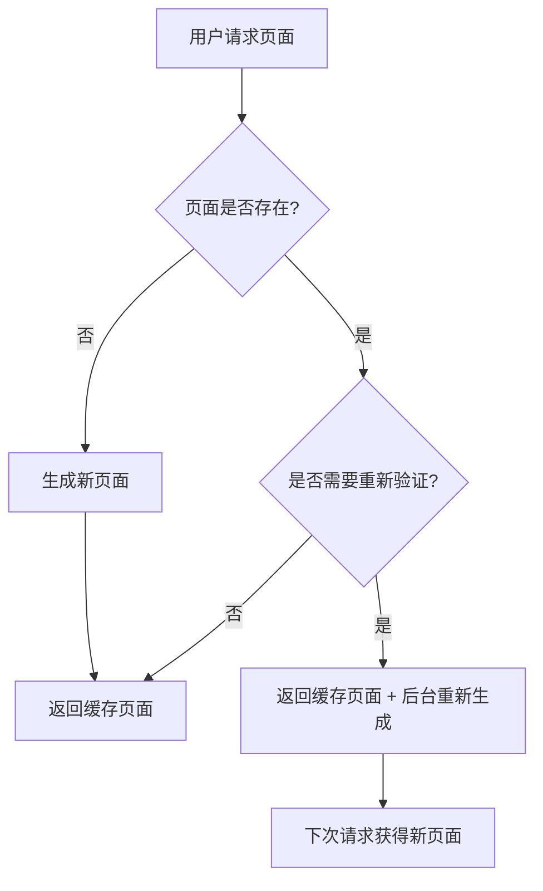

# ISR (Incremental Static Regeneration) 学习指南

## 🎯 什么是 ISR？

ISR (增量静态再生成) 是 Next.js 的一个强大功能，它结合了静态生成 (SSG) 的性能优势和服务端渲染 (SSR) 的灵活性。

### 核心概念

- **静态优先**: 页面在构建时预生成，确保最快的加载速度
- **按需更新**: 数据过期后，后台自动重新生成页面
- **缓存策略**: 用户始终看到缓存的快速页面，更新在后台进行
- **渐进式**: 只更新需要更新的页面，不影响整体性能

## 🛠️ 如何实现 ISR

### 1. 页面级 ISR

在页面组件中导出 `revalidate` 配置：

```javascript
// app/isr-example/page.js
export default async function ISRExample() {
  // 你的页面组件
  return <div>ISR 页面内容</div>;
}

// 设置重新验证时间
export const revalidate = 30; // 30秒后重新验证
```

### 2. fetch 级 ISR

在数据获取时设置重新验证：

```javascript
async function getData() {
  const res = await fetch('https://api.example.com/data', {
    next: { revalidate: 60 } // 60秒后重新验证这个 API 调用
  });
  
  return res.json();
}
```

### 3. 混合配置

```javascript
// 页面级：30秒重新验证
export const revalidate = 30;

async function getData() {
  // API 调用：5分钟重新验证
  const userRes = await fetch('/api/user', {
    next: { revalidate: 300 }
  });
  
  // 静态数据：1小时重新验证
  const settingsRes = await fetch('/api/settings', {
    next: { revalidate: 3600 }
  });
  
  return {
    user: await userRes.json(),
    settings: await settingsRes.json()
  };
}
```

## 📊 ISR 工作流程



## ⚙️ 配置选项

### revalidate 值说明

| 值 | 含义 | 使用场景 |
|---|---|---|
| `false` | 永不重新验证 | 完全静态内容 |
| `0` | 每次请求都重新验证 | 类似 SSR |
| `30` | 30秒后重新验证 | 频繁更新的内容 |
| `3600` | 1小时后重新验证 | 定期更新的内容 |
| `86400` | 24小时后重新验证 | 每日更新的内容 |

### 动态配置

```javascript
export async function generateStaticParams() {
  return [
    { id: '1' },
    { id: '2' },
    // ... 更多参数
  ];
}

export default async function DynamicISRPage({ params }) {
  // 根据参数获取数据
  const data = await fetch(`/api/posts/${params.id}`, {
    next: { revalidate: 3600 }
  });
  
  return <div>{/* 页面内容 */}</div>;
}

export const revalidate = 1800; // 30分钟
```

## 🎨 最佳实践

### 1. 选择合适的重新验证时间

```javascript
// ❌ 过于频繁 - 失去缓存优势
export const revalidate = 1; // 1秒

// ✅ 合理频率 - 平衡性能和新鲜度
export const revalidate = 300; // 5分钟

// ✅ 不同数据不同策略
async function getData() {
  const [hotNews, weatherData, userProfile] = await Promise.all([
    fetch('/api/news', { next: { revalidate: 60 } }),      // 热点新闻：1分钟
    fetch('/api/weather', { next: { revalidate: 1800 } }), // 天气数据：30分钟
    fetch('/api/profile', { next: { revalidate: 86400 } }) // 用户信息：24小时
  ]);
  
  return {
    news: await hotNews.json(),
    weather: await weatherData.json(),
    profile: await userProfile.json()
  };
}
```

### 2. 错误处理

```javascript
async function getData() {
  try {
    const res = await fetch('https://api.example.com/data', {
      next: { revalidate: 60 }
    });
    
    if (!res.ok) {
      throw new Error('Failed to fetch data');
    }
    
    return await res.json();
  } catch (error) {
    console.error('Data fetch error:', error);
    
    // 返回备用数据或缓存数据
    return {
      data: '备用数据',
      error: true,
      timestamp: new Date().toISOString()
    };
  }
}
```

### 3. 性能优化

```javascript
// 并行获取多个数据源
export default async function OptimizedISRPage() {
  const [critical, secondary] = await Promise.all([
    // 关键数据：更频繁的更新
    fetch('/api/critical', { next: { revalidate: 30 } }),
    
    // 次要数据：较少的更新
    fetch('/api/secondary', { next: { revalidate: 3600 } })
  ]);
  
  return (
    <div>
      <CriticalSection data={await critical.json()} />
      <SecondarySection data={await secondary.json()} />
    </div>
  );
}
```

## 🔍 监控和调试

### 1. 检查构建输出

```bash
pnpm run build
```

查看构建结果，确认 ISR 配置：
```
Route (app)                Size    First Load JS    Revalidate
├ ○ /isr-example          505 B   101 kB           30s
```

### 2. 开发时调试

```javascript
// 添加时间戳来追踪重新生成
export default async function ISRPage() {
  const now = new Date();
  
  console.log('页面生成时间:', now.toISOString());
  
  return (
    <div>
      <p>生成时间: {now.toLocaleString()}</p>
      {/* 其他内容 */}
    </div>
  );
}
```

### 3. 测试 ISR 功能

1. **构建并启动生产模式**:
   ```bash
   pnpm run build
   pnpm start
   ```

2. **访问页面多次**: 观察时间戳变化

3. **等待重新验证时间**: 确认数据更新

## 🚀 高级用法

### 1. 条件重新验证

```javascript
export default async function ConditionalISR() {
  const data = await getData();
  
  // 根据数据决定重新验证频率
  return <div>{/* 内容 */}</div>;
}

// 动态设置重新验证时间
export async function generateMetadata() {
  const config = await getConfig();
  
  return {
    other: {
      revalidate: config.isHighTraffic ? 60 : 3600
    }
  };
}
```

### 2. 手动重新验证

```javascript
// API 路由: app/api/revalidate/route.js
import { revalidatePath } from 'next/cache';

export async function POST(request) {
  const path = await request.json();
  
  try {
    revalidatePath(path);
    return Response.json({ revalidated: true });
  } catch (err) {
    return Response.json({ error: 'Error revalidating' }, { status: 500 });
  }
}
```

## 📈 性能对比

| 渲染模式 | 首屏加载 | SEO | 数据新鲜度 | 服务器负载 |
|---------|---------|-----|-----------|------------|
| SSG | ⭐⭐⭐⭐⭐ | ⭐⭐⭐⭐⭐ | ⭐ | ⭐⭐⭐⭐⭐ |
| SSR | ⭐⭐ | ⭐⭐⭐⭐⭐ | ⭐⭐⭐⭐⭐ | ⭐ |
| **ISR** | **⭐⭐⭐⭐⭐** | **⭐⭐⭐⭐⭐** | **⭐⭐⭐⭐** | **⭐⭐⭐⭐** |
| CSR | ⭐ | ⭐ | ⭐⭐⭐⭐⭐ | ⭐⭐⭐ |

## 🎯 使用场景

### ✅ 适合使用 ISR

- **电商产品页面**: 价格和库存需要定期更新
- **新闻网站**: 内容需要保持相对新鲜
- **博客文章**: 评论数、点赞数定期更新
- **数据仪表板**: 定期更新的统计数据
- **API 文档**: 偶尔更新的技术文档

### ❌ 不适合使用 ISR

- **实时聊天**: 需要实时数据
- **股票价格**: 秒级数据更新
- **用户个人信息**: 每个用户都不同
- **购物车**: 实时用户状态

## 📚 学习资源

- [Next.js ISR 官方文档](https://nextjs.org/docs/app/building-your-application/data-fetching/incremental-static-regeneration)
- [ISR 示例项目](/isr-example)
- [Vercel ISR 案例研究](https://vercel.com/docs/incremental-static-regeneration)

## 🎉 总结

ISR 是现代 Web 开发的重要技术，它让我们能够：

1. **保持性能**: 用户始终获得快速的静态页面
2. **保证新鲜度**: 数据在后台自动更新
3. **降低成本**: 减少服务器负载和构建时间
4. **提升用户体验**: 快速加载 + 新鲜内容

通过合理配置重新验证时间和错误处理，ISR 可以显著提升你的应用性能和用户体验！

---

💡 **下一步**: 访问 [/isr-example](/isr-example) 查看实际运行的 ISR 示例！ 